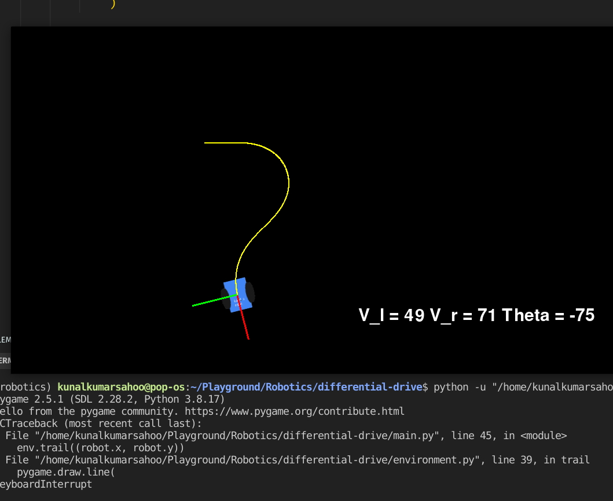
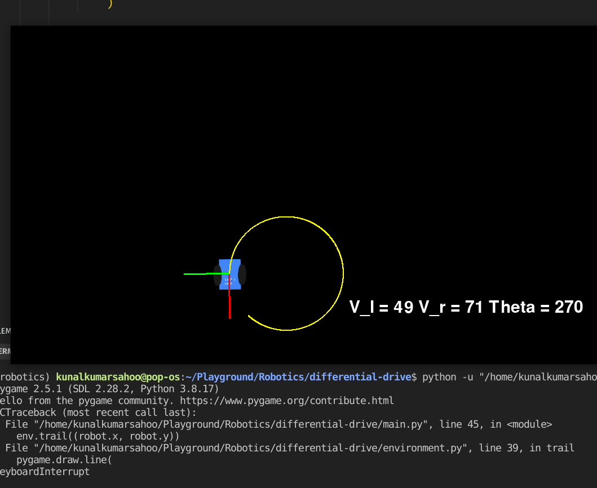

# Differential Drive Robot Simulation

This project simulates a differential drive robot using the Pygame library in Python. The robot can move in a 2D environment, and its movements are controlled by keyboard inputs. The simulation includes features like displaying velocity information, drawing a robot frame, and creating a trail as the robot moves.

## Project Structure

The project consists of the following files:

1. **main.py**: This is the main script that runs the robot simulation. It initializes the Pygame environment, creates an instance of the robot, and manages the simulation loop.

2. **environment.py**: This module defines the `Environment` class, which handles the graphical aspects of the simulation. It sets up the Pygame window, displays velocity information, draws the robot frame, and creates a trail behind the robot.

3. **robot.py**: The `Robot` class is defined in this module. It represents the differential drive robot and handles its movement logic. The robot's position and orientation are updated based on velocity inputs.

## Robot Image

Here is an image of the robot used in the simulation:


You can replace this image with your own if desired.

## How to Run

To run the simulation, follow these steps:

1. Make sure you have Python installed on your system.

2. Install the Pygame library if you haven't already. You can install it using pip:
   ```bash
   pip install pygame
   ```

3. Download or clone the project files to your local machine.

4. Run the `main.py` script using Python:
   ```bash
   python main.py
   ```

5. The Pygame window will open, and you can control the robot's movement using the following keys:
   - W: Increase left wheel velocity.
   - S: Decrease left wheel velocity.
   - A: Increase right wheel velocity.
   - D: Decrease right wheel velocity.

6. The simulation will display information about the robot's velocity (V_l and V_r) and its orientation (Theta) in the top-left corner of the window.

7. You can observe the robot's movement, and a trail will be drawn as it moves.

## Working




## Project Notes

- The robot's movement is simulated in a differential drive fashion, where the left and right wheels can have different velocities, allowing it to turn and move forward/backward.

- The robot's velocity limits are defined in the `Robot` class, and they can be adjusted as needed.

- The simulation loop updates the robot's position and redraws the environment in real-time based on user input.

- The robot's orientation is displayed using a red X-axis and a green Y-axis.

- The robot's trail is drawn in yellow, and old trail points are removed to prevent excessive memory usage.

Feel free to modify the code and experiment with different aspects of the simulation to suit your needs. Enjoy simulating your differential drive robot!

## Author

*Kunal Kumar Sahoo*

## License

This project is licensed under the MIT License - see the [LICENSE](LICENSE) file for details.